#####TodoList

#### Summary
     A Simple Task Scheduler application 

### Kotlin
### MVVM
### Retrofit
### LiveData
### Jetpack Navigation
### Clean Architecture
### Room Database

#LOGIN SCREEN
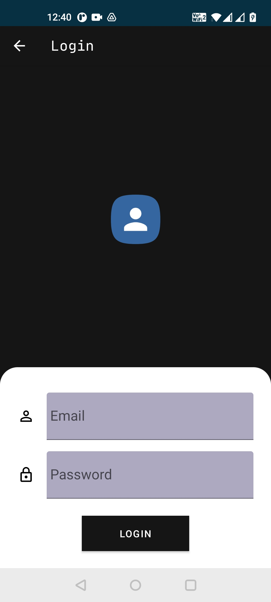

#LOADING SCREEN
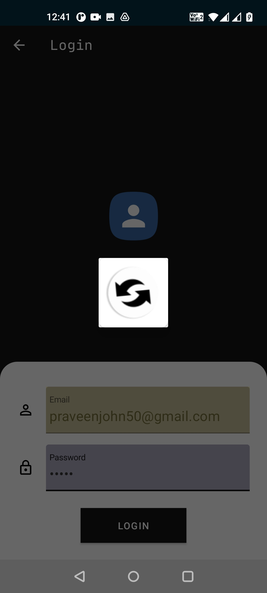

#HOME SCREEN
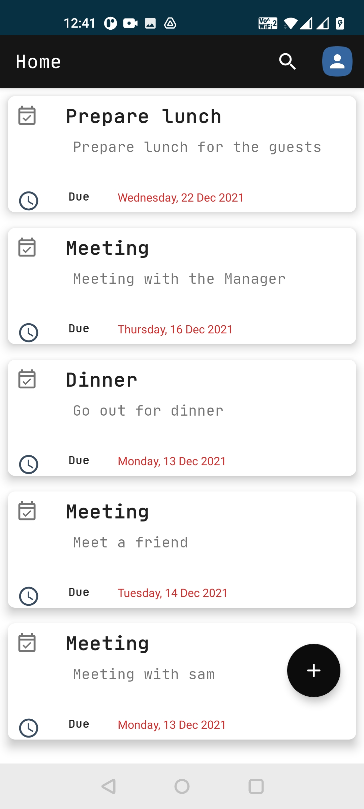

#PROFILE
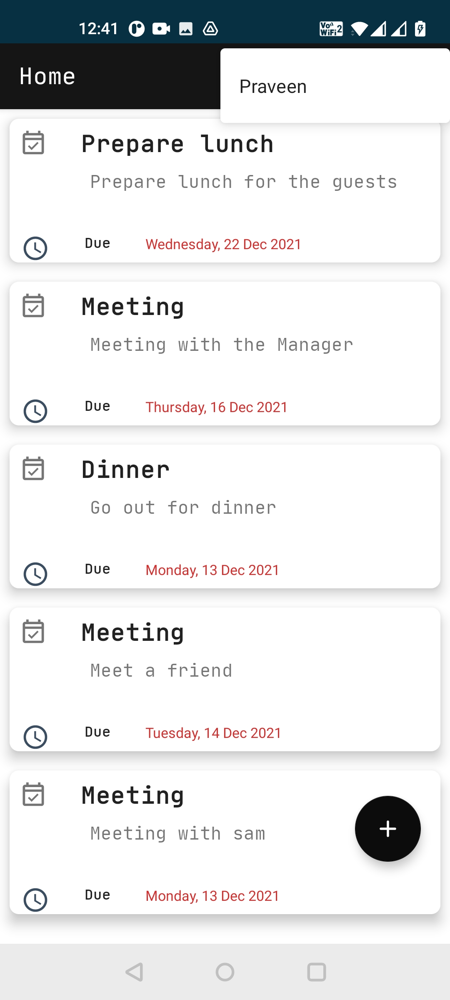

#CREATE TASK
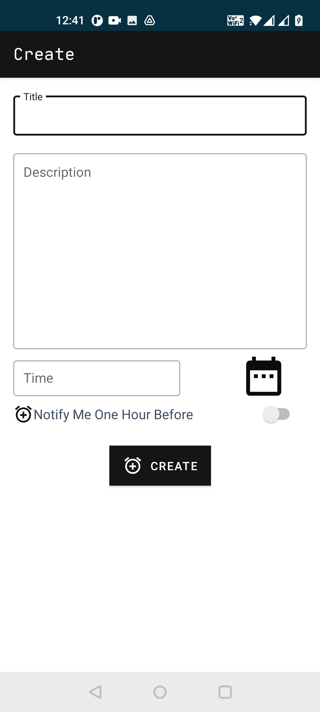

#UPDATE TASK
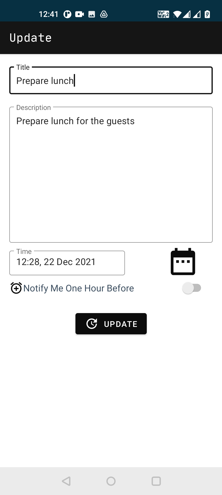

#DATE PICKER
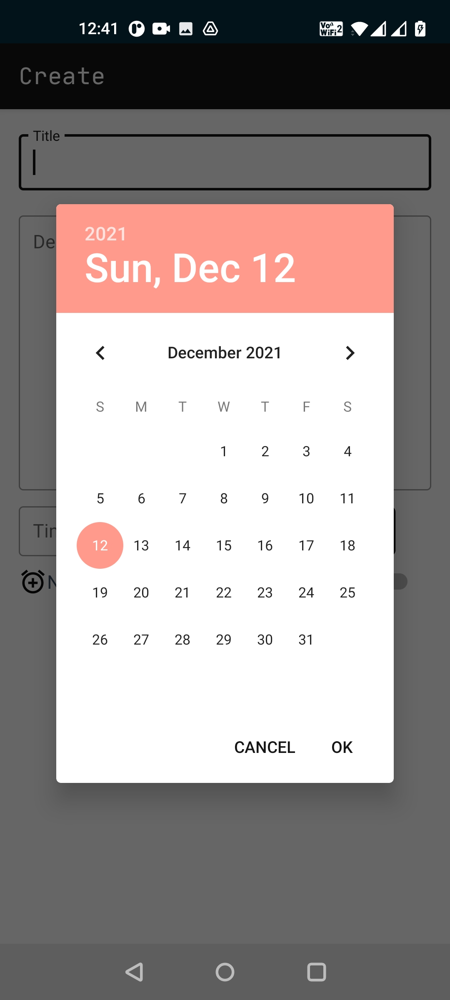

#TIME PICKER
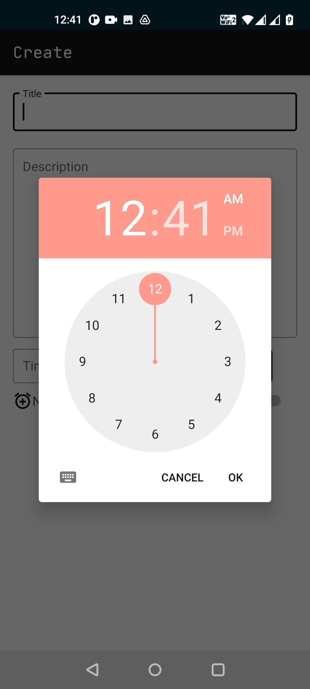

#DELETE TASK
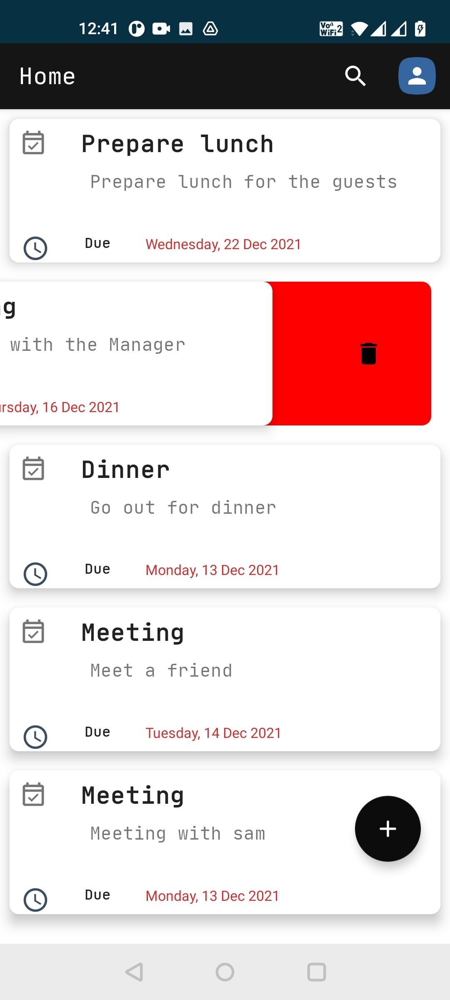

#DELETE CONFIRMATION
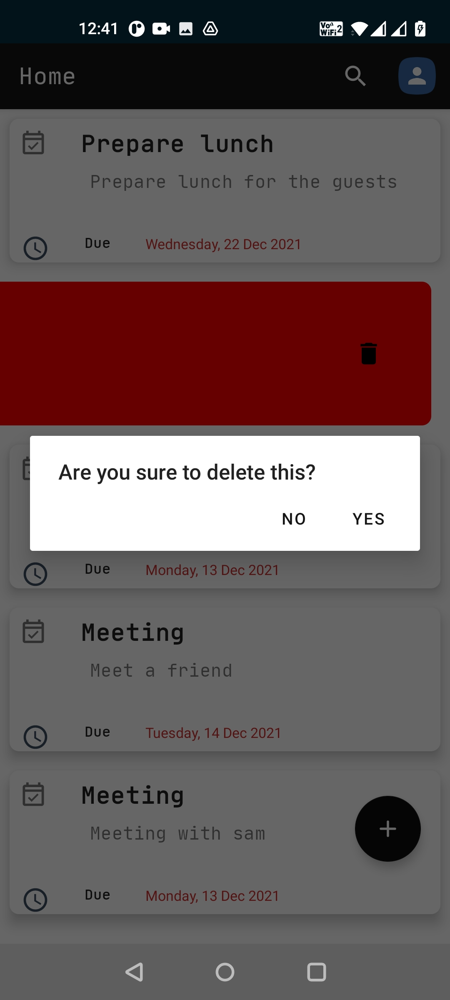

#SEARCH
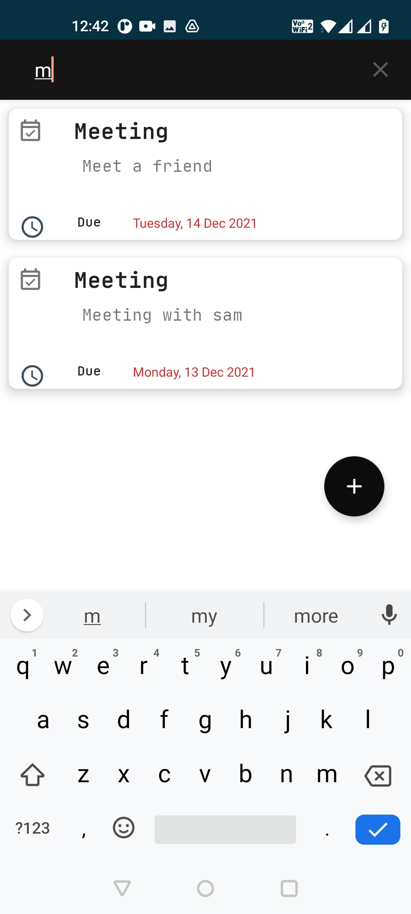

